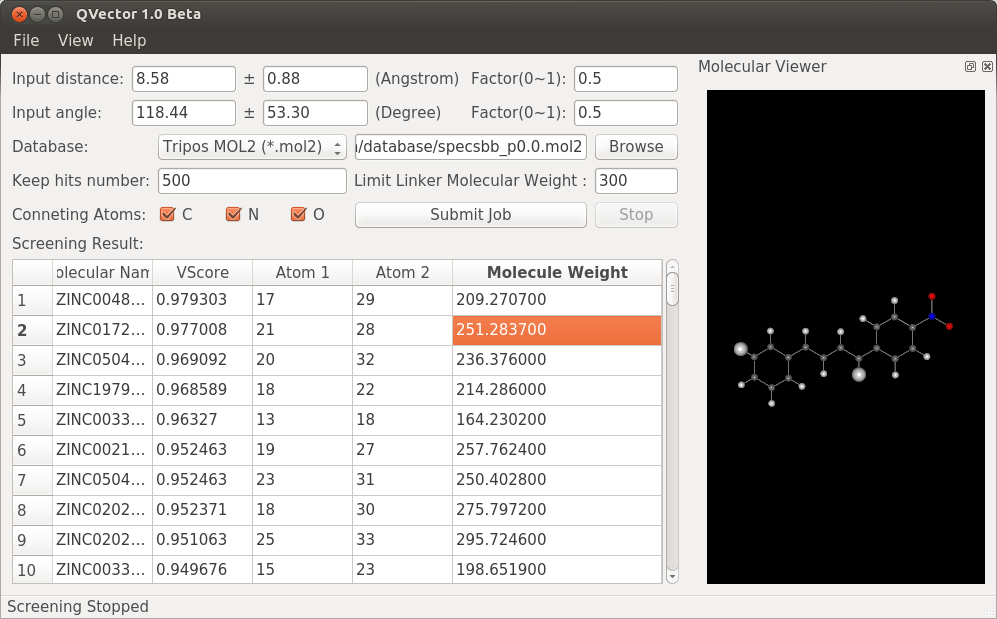

# QVector

## Introduction

Virtual screening for chemical linkers.

## Environment

Ubuntu 14.04+
```
sudo apt-get install qtcreator qt5-default libqt5webkit5-dev
```
## Input

MOL2 or SDF files




